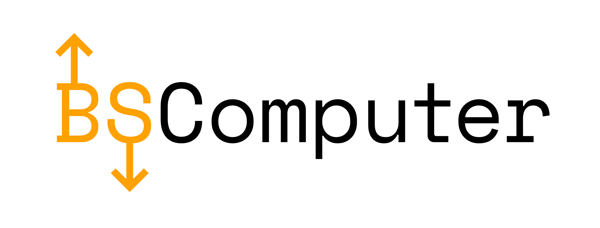

Welcome to Binary Switch (BS) Computer: the silliest IDE on the internet.

I mean, that's what it is for now: an IDE of sorts, using `tkinter`. Later, I will translate `input.pyw` into a panel of light switches and buttons that accomplish the same functionality.

### Demos:

1. [Link to Demo #1](https://www.youtube.com/watch?v=z2wleAoEfC4&ab_channel=AGForero)
